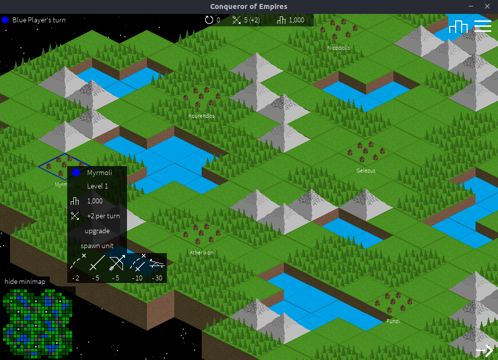
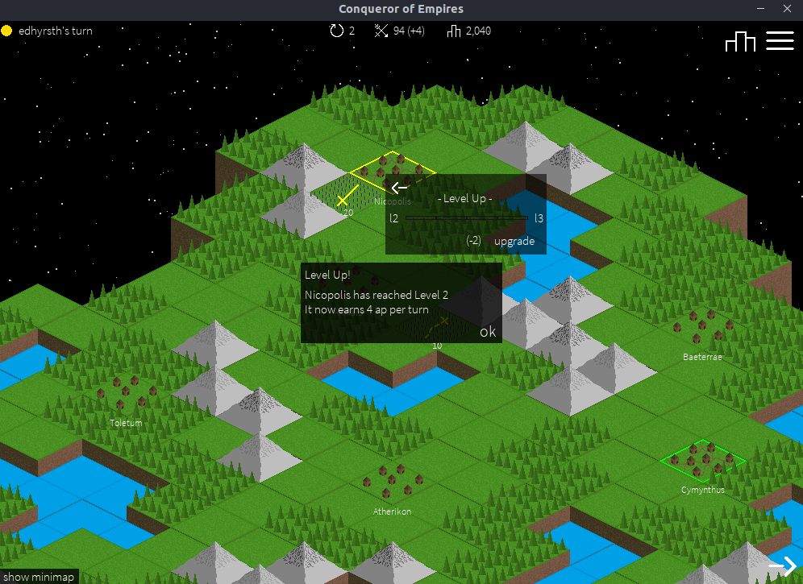

# Conqueror of Empires
Conqueror of Empires is a turn-based strategy game where up to 4 local players battle to be victorious, by expanding their empires, and controlling units to conquer cities and attack the enemy.

The game was inspired by [Polytopia](http://midjiwan.com/polytopia.html) and [Civilisation](https://civilization.com/) and made using python and pygame.  
To download executables see [releases](https://github.com/Ben-Ryder/Conqueror-of-Empires/releases).

## Playing the Game
#### From Source:  
Run the `main.py` file from the repository root.

#### Executables:  
**Windows**  
Run the `main.exe` file from the application folder.

**Linux (Ubuntu/Debian)**  
Run the `main` file from the application folder.  
*Note: You may have to change the permissions of the file to allow it to run as a program. See [here](https://askubuntu.com/questions/503558/i-cant-run-application-x-executable-files-in-ubuntu-14-04)*.

## Screenshots

## Dependencies
If running from source then dependencies can be installed from the `requirements.txt` file.

## Contributions
All contributions are welcome. Feel free to raise an issue, suggest new features or even PR something back if you want.